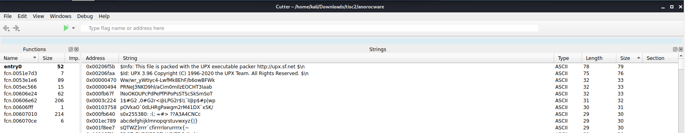
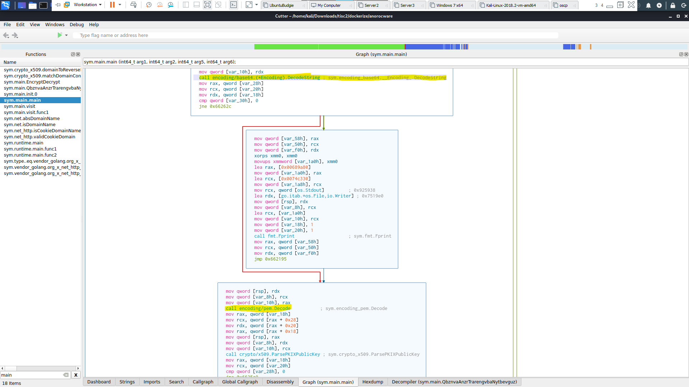
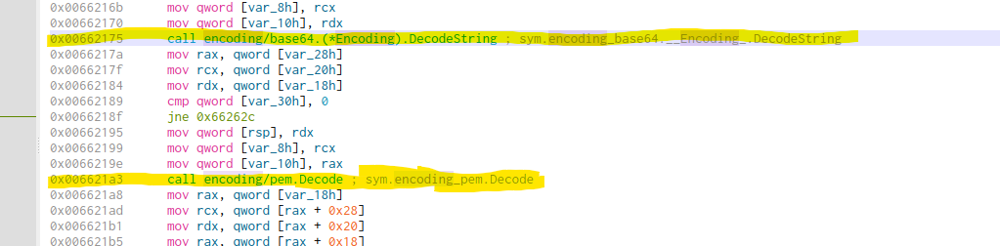

# Stage 2

We are given the zip file containing lots of the encrypted files, and the binary that encrypts the files itself.

Initial analysis of the binary indicates that it has been packed by UPX, so we can go ahead and unpack it.



```bash
kali@kali:~/Downloads/tisc2$ upx -d anorocware 
                       Ultimate Packer for eXecutables
                          Copyright (C) 1996 - 2020
UPX 3.96        Markus Oberhumer, Laszlo Molnar & John Reiser   Jan 23rd 2020

        File size         Ratio      Format      Name
   --------------------   ------   -----------   -----------
   7406375 <-   3993332   53.92%   linux/amd64   anorocware

Unpacked 1 file.
kali@kali:~/Downloads/tisc2$ 
```

Opening the file up in Cutter, we can see a lot of functions, and realised they used Golang for the program itself. So I filtered the program to only display the main functions on the left side, and looked around at the graph view, and from there, we can see Base64 decode and PEM, which was what we were looking for!



We can now copy the instruction address of `call encoding/base64.(*Encoding).DecodeString` in the Disassembly view, so that we can set a breakpoint there in `gdb` to see what arguments would be passed into the `DecodeString` function itself.



We start `gdb` (I installed pwndbg extension here) and we set the breakpoint at `0x00662175`. We run the program, and `pwndbg` displays a ton of useful information, like in the `RCX` address, where it seems to be storing some string.

```bash
kali@kali:~/Downloads/tisc2/dockerize$ gdb anorocware 
GNU gdb (Debian 9.2-1) 9.2
Copyright (C) 2020 Free Software Foundation, Inc

...

pwndbg> b *0x00662175
Breakpoint 1 at 0x662175: file /home/hjf98/Documents/CSPC2020Dev/goware/main.go, line 246.
pwndbg> r
Starting program: /home/kali/Downloads/tisc2/dockerize/anorocware 
[Thread debugging using libthread_db enabled]
Using host libthread_db library "/lib/x86_64-linux-gnu/libthread_db.so.1".
...

Thread 1 "anorocware" hit Breakpoint 1, 0x0000000000662175 in main.main () at /home/hjf98/Documents/CSPC2020Dev/goware/main.go:246
246     /home/hjf98/Documents/CSPC2020Dev/goware/main.go: No such file or directory.
LEGEND: STACK | HEAP | CODE | DATA | RWX | RODATA
──────────────────────────────────────────────────────────────────────────────────────────────────[ REGISTERS ]───────────────────────────────────────────────────────────────────────────────────────────────────
 RAX  0xc000182000 ◂— 0x4847464544434241 ('ABCDEFGH')
 RBX  0x7c4
 RCX  0xc00038b000 ◂— 0x4331534c7430534c ('LS0tLS1C')
 RDX  0x7c4
 RDI  0x64
 RSI  0x6fd9d7 (string.*+76319) ◂— 0x4633574c76375b4e ('N[7vLW3F')
...
────────────────────────────────────────────────────────────────────────────────────────────────────[ DISASM ]────────────────────────────────────────────────────────────────────────────────────────────────────
 ► 0x662175 <main.main+2085>    call   encoding/base64.(*Encoding).DecodeString <encoding/base64.(*Encoding).DecodeString>
        rdi: 0x64
        rsi: 0x6fd9d7 (string.*+76319) ◂— 0x4633574c76375b4e ('N[7vLW3F')
        rdx: 0x7c4
        rcx: 0xc00038b000 ◂— 0x4331534c7430534c ('LS0tLS1C')
 
...
────────────────────────────────────────────────────────────────────────────────────────────────────[ STACK ]─────────────────────────────────────────────────────────────────────────────────────────────────────
00:0000│ rsp  0xc0001bfc08 —▸ 0xc000182000 ◂— 0x4847464544434241 ('ABCDEFGH')
01:0008│      0xc0001bfc10 —▸ 0xc00038b000 ◂— 0x4331534c7430534c ('LS0tLS1C')
02:0010│      0xc0001bfc18 ◂— 0x7c4
03:0018│      0xc0001bfc20 ◂— 0x64 /* 'd' */
04:0020│      0xc0001bfc28 —▸ 0xc00038b000 ◂— 0x4331534c7430534c ('LS0tLS1C')
05:0028│      0xc0001bfc30 ◂— 0x7c4
06:0030│      0xc0001bfc38 ◂— 0x0
... ↓
──────────────────────────────────────────────────────────────────────────────────────────────────[ BACKTRACE ]───────────────────────────────────────────────────────────────────────────────────────────────────
 ► f 0           662175 main.main+2085
   f 1           43692a runtime.main+506
   f 2           463061 runtime.goexit+1
   f 3                0
──────────────────────────────────────────────────────────────────────────────────────────────────────────────────────────────────────────────────────────────────────────────────────────────────────────────────
```

We can then print out the `RCX` pointer contents, and we can see it stores a lot of text, and it looks like it is in base64 (full contents are at [stage2/b64.txt](stage2/b64.txt)).

```bash
pwndbg> x/16s $rcx
0xc00038b000:   "LS0tLS1CRUdJTiBQVUJMSUMgS0VZLS0tLS0KTUlJRUlEQU5CZ2txaGtpRzl3MEJBUUVGQUFPQ0JBMEFNSUlFQ0FLQ0JBRUFtOTliMnB2dHJWaVcrak4vM05GZgp3OGczNmRRUjZpSnIrY3lSZStrOFhGenVIVU80TE4zdGs3NnRGUzhEYmFDY1lGaXVmOEdzdWdjUm1R"...
0xc00038b0c8:   "REVyUFpmCnFna3ZYWnB1ZmZmVGZqVEIramUvV2k0M2J3THF0dzBXNGNYb1BXMzN1R1ZhV1pYMG9MektDL0F4Zzdrd0l0bUcKeG5uMzIxVEFqRVpnVGJMK09hTmtjSHpmUTdVendhRXA5VVB0VDhwR1lvTkpIbFgzZmtGcTJpVnk3N3VJNGdSSwpNZjh1alRma0lISGpR"...

...

0xc00038b708:   "bXk3YlFzSFlYSUhVZ2tCWFl6ZHkvdStOb2RLQWpoZFZwaUpiekluY3oKU2RvbFhpbmlLd05VTFc4VmpqUzlLVFNSd2lkcWVPa2twTmVJcWlSbldUM1RUTUFNemI1ajBqRUdGN0wzRE9NUAo2UUlCQXc9PQotLS0tLUVORCBQVUJMSUMgS0VZLS0tLS0K"
0xc00038b7c5:   ""
0xc00038b7c6:   ""
0xc00038b7c7:   ""
0xc00038b7c8:   ""
0xc00038b7c9:   ""
0xc00038b7ca:   ""
pwndbg> 
```

Using an online base64 decoder (because I'm lazy) will yield a very nice public key!
```pubkey
-----BEGIN PUBLIC KEY-----
MIIEIDANBgkqhkiG9w0BAQEFAAOCBA0AMIIECAKCBAEAm99b2pvtrViW+jN/3NFf
w8g36dQR6iJr+cyRe+k8XFzuHUO4LN3tk76tFS8DbaCcYFiuf8GsugcRmQDErPZf
qgkvXZpufffTfjTB+je/Wi43bwLqtw0W4cXoPW33uGVaWZX0oLzKC/Axg7kwItmG
xnn321TAjEZgTbL+OaNkcHzfQ7UzwaEp9UPtT8pGYoNJHlX3fkFq2iVy77uI4gRK
Mf8ujTfkIHHjQ7BEzgEgk8kqxGaSPlINQs65P4tvOpihqpwUVpAjPLNBTt9Hz1F/
fR+aDsJQRKZNMrWRLuMYiO2Mx9cZBnwzL9KuFRvHelO7BWayU9f0XOpg/zybEQOL
ux+jmsUsTsQbjK9cB67Ma21D+XJHyKgKuP9u14mVCZgCBk9lybS1bxdvFDQPgkyc
M3z9vuucCU1Eu2D0lhFmJ3FQfZkAY++XHUpiwui9NO3A9UG7amyXbOSclF2X9kRq
0CwmqOtBRBEWISe5rdzc/ATOP3PqDjGwySXxWZDCH8rrgnzWpv2LriYQTnf2cE0G
/iI8RwjYoGLWzeLVRr1hhZ8Y5s4R/sR497WenkRcpOLOkDVge7MusTOWh4eNi4go
PldsiYTqTndA1wV67r09ujpp8VvpdLuo+4h+7p/pfpXMsx8dALom4sfkYcJHhObk
xt5CpNCkVXh5tsGheFb7v85GiNFy17zualMda32BinPeEbFrqKwD2Z4R5QgQuB8u
IwjqSTgNo9Uvvch6lWCbj9e+80ugV4o7jHCd/56FkuvhCqiINdZDUU4ZB37hdelf
eE9NbxDjKG8V7aCdwqJJDYGiz/3jmuCfB/k5FkoHSANgbLE0A5Smk3T8tuv8Sz+f
v4rrPxmpn8X2Sm1Foz+U0BWzP+VLmpLnnyXkrOHyn8lJFbn/U5NWGRLn+ev2CSkw
AI/TfHALqTvjqlGQxTTaY7Znkn5i+D1LztK8cpSZXdDVoRh+/vMIEiNuk8++/s6a
HNd7wuFkY/Z8jjJ1jH/csF37mGYAUxp32nRk5wRp/c6eWZPM+zGibfEnmFW5yUEU
YbX4hzzGr5Q6f/sysuzhaylWi3XCvIrH6LBjFNu3UJ0VIzcJN0kxaABaXY8JUDYX
tXULipvUOqkttOqJSxOXWg72SWKLKv/QvfDRVXedUk066k7RL1okpbMnwYlfYg7J
mpZZR2CNNwbMkQm2TmrA/MZudvqtsX9PpkgJI+ZWjUwVtGRUTdDMxZWx4H3neJiy
8m8udk42RN0j3n0wVXsWt6Qmy7bQsHYXIHUgkBXYzdy/u+NodKAjhdVpiJbzIncz
SdolXiniKwNULW8VjjS9KTSRwidqeOkkpNeIqiRnWT3TTMAMzb5j0jEGF7L3DOMP
6QIBAw==
-----END PUBLIC KEY-----
```

So we run the base64 file onto `sha256sum`.
```
kali@kali:~/Downloads/tisc2$ sha256sum b64.txt 
8eaf2d08d5715eec34be9ac4bf612e418e64da133ce8caba72b90faacd43ceee  b64.txt
```

We take the hash, encapsulate it in `TISC20{}` and submit it to finish the stage!
```
TISC20{8eaf2d08d5715eec34be9ac4bf612e418e64da133ce8caba72b90faacd43ceee}
```