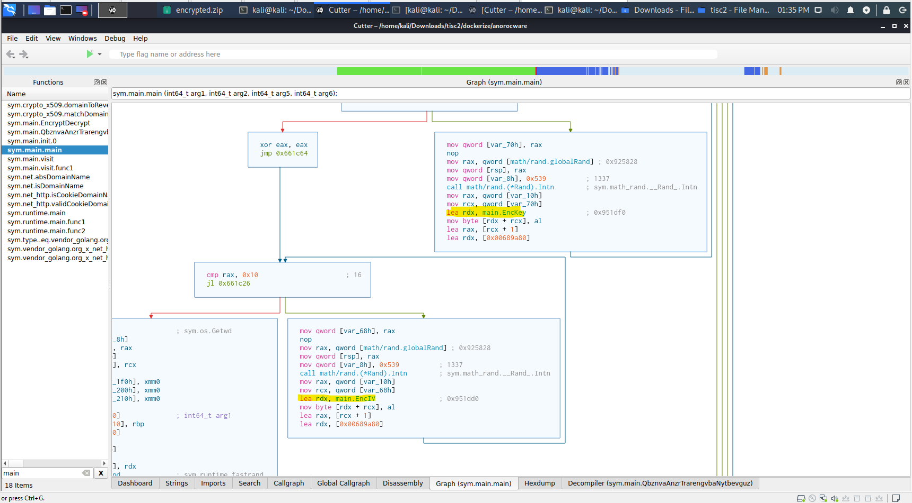
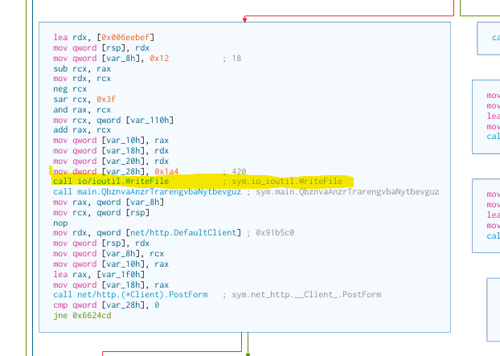
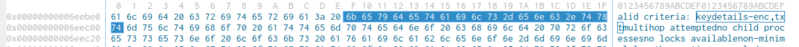
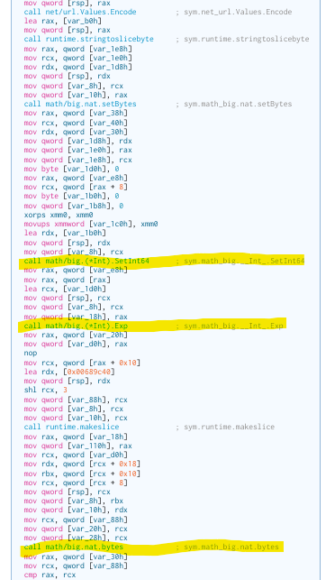
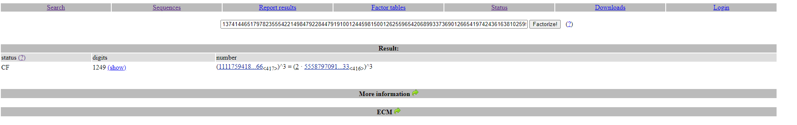
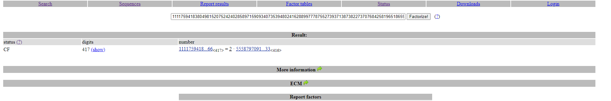
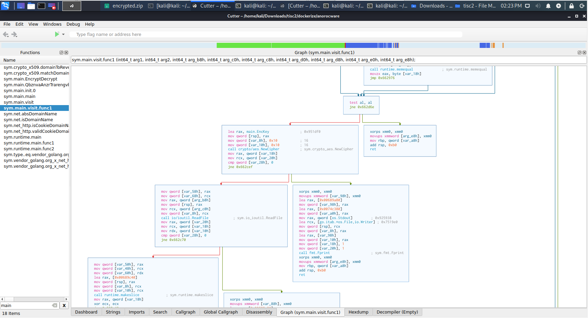
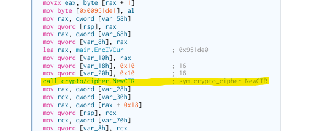

# Stage 3

>This stage was a bit painful for me, as I tried many programming languages and websites (even 'learning' Golang) for AES-CTR, but it does not want to decrypt, so I decided to cheese it and inject the key and IV into the ransomware (as AES-CTR's encrypt and decrypt mode are invertible).

So for this stage, we were given the task to attempt to decrypt the files to see if it is recoverable. From the files given we can see that there is a file called `keydetails-enc.txt`, and showing the hex values of it yields nothing of interest as of now.

```bash
kali@kali:~/Downloads/tisc2$ xxd keydetails-enc.txt 
00000000: 04ac a8af 91f9 7ef1 98ba 32c8 20e8 868d  ......~...2. ...
00000010: eb69 3f86 f763 d3a2 879a 84fa 8e7a f6f3  .i?..c.......z..
00000020: 9610 7701 b480 e453 ec69 b7e3 f72f 0252  ..w....S.i.../.R
00000030: 0f40 8a98 c163 db6c 70f9 902e ab87 c882  .@...c.lp.......
...
000001d0: 8455 5f44 12da 28d7 434b fa27 d6b4 cdf4  .U_D..(.CK.'....
000001e0: da50 889c 9285 c8ca 0e60 6398 bfb3 b348  .P.......`c....H
000001f0: 9475 2667 df01 a280 23b7 297d 3a16 978f  .u&g....#.)}:...
00000200: 4a97 4cf2 d040 88                        J.L..@.
```

Looking back at Cutter, we can see in the graph that even though Stage 1's public key is being initialized, it is not being used in any way after that. However we can see that at the start of the program, the key and IV are generated then.



From that, we know that it is a randomly generated number from the operating system, and it does not seem like it is seeded in any way. A few block below we can see that the program writes to a file before reading anything, which may indicate that it is creating a new file..?



Looking up a few instructions, there is a `lea rdx, [0x006eebef]` instruction. We can open it (right click > 0x006eebef (used here) > Hexdump) and see what it gives, and it shows the `keydetails-enc.txt` file! This shows that it is probably writing something important, and the instructions above must indicate the content and encoding.



The block above the write to file code possibly shows the encryption or encoding scheme they used. From this we can see, they are using Go's `big_nat` to perform an exponential function and converting it to bytes to store in a file.



Since we cannot directly see what values they are trying to power with, therefore we will get the address of the instruction running the `call math/big.(*Int).Exp` function, and setting a breakpoint there to see the values in the register and stack.

```bash
pwndbg> b *0x006622fd
Breakpoint 1 at 0x6622fd: file /home/hjf98/Documents/CSPC2020Dev/goware/main.go, line 269.
pwndbg> r
Starting program: /home/kali/Downloads/tisc2/anorocware 
[Thread debugging using libthread_db enabled]
Using host libthread_db library "/lib/x86_64-linux-gnu/libthread_db.so.1".
...

Thread 7 "anorocware" hit Breakpoint 1, 0x00000000006622fd in main.main () at /home/hjf98/Documents/CSPC2020Dev/goware/main.go:269
269     /home/hjf98/Documents/CSPC2020Dev/goware/main.go: No such file or directory.
LEGEND: STACK | HEAP | CODE | DATA | RWX | RODATA
──────────────────────────────────────────────────────────────────────────────────────────────────[ REGISTERS ]───────────────────────────────────────────────────────────────────────────────────────────────────
 RAX  0xc000238080 ◂— 0x0
 RBX  0xc0000fddb8 ◂— 0x0
 RCX  0xc0000fddd8 —▸ 0x414100 (runtime.mapaccess2_faststr+528) ◂— movzx  r8d, byte ptr [rdx + rcx]
 RDX  0xc00025e0a0 ◂— 0x3
 RDI  0x8
 RSI  0x0
...
────────────────────────────────────────────────────────────────────────────────────────────────────[ DISASM ]────────────────────────────────────────────────────────────────────────────────────────────────────
 ► 0x6622fd <main.main+2477>    call   math/big.(*Int).Exp <math/big.(*Int).Exp>
        rdi: 0x8
        rsi: 0x0
        rdx: 0xc00025e0a0 ◂— 0x3
        rcx: 0xc0000fddd8 —▸ 0x414100 (runtime.mapaccess2_faststr+528) ◂— movzx  r8d, byte ptr [rdx + rcx]
        r8: 0x6892c0 (type.*+151712) ◂— 0x8
 
   0x662302 <main.main+2482>    mov    rax, qword ptr [rsp + 0x20]
...
────────────────────────────────────────────────────────────────────────────────────────────────────[ STACK ]─────────────────────────────────────────────────────────────────────────────────────────────────────
00:0000│ rsp  0xc0000fdc08 —▸ 0xc0000fddd8 —▸ 0x414100 (runtime.mapaccess2_faststr+528) ◂— movzx  r8d, byte ptr [rdx + rcx]
... ↓
02:0010│      0xc0000fdc18 —▸ 0xc0000fddb8 ◂— 0x0
03:0018│      0xc0000fdc20 —▸ 0xc000238080 ◂— 0x0
04:0020│      0xc0000fdc28 ◂— 0xab
05:0028│      0xc0000fdc30 ◂— 0xb0
06:0030│      0xc0000fdc38 —▸ 0xc000284410 ◂— 'f27f3e1bdea433d808a4be710c6c24c0=dIenihcaM&302.39.87.101=PI&wUK28%4D%E6D%B5%EDC3%6B%C7%81%DC%V=yeKcnE&7C%+C5%1B%_RNh4A%621%EF%FA%11%D3%8C%=VIcnE&gnajnaP+tikuB+gnopmaK=ytiC'
07:0038│      0xc0000fdc40 ◂— 0x16
──────────────────────────────────────────────────────────────────────────────────────────────────[ BACKTRACE ]───────────────────────────────────────────────────────────────────────────────────────────────────
 ► f 0           6622fd main.main+2477
   f 1           43692a runtime.main+506
   f 2           463061 runtime.goexit+1
   f 3                0
──────────────────────────────────────────────────────────────────────────────────────────────────────────────────────────────────────────────────────────────────────────────────────────────────────────────────
pwndbg> 
```

From the runtime, we can see a lot of interesting things, such as the reversed order for what looks like the EncKey and EncIV in the stack, so we can confirm they are using it to store in the file.

Before the function call, it looks like it is passing in the string data, as well as `0x3`, which _probably_ means it is powering the string with 3.

So we can try to retrieve the old key and IV by taking the zip file's `keydetails-enc.txt`, converting it to an integer, then using FactorDB, calculate the cube root of the number to see if we get anything useful.

```bash
kali@kali:~/Desktop$ xxd -p keydetails-enc.txt | tr -d '\n'
04aca8af91f97ef198ba32c820e8868deb693f86f763d3a2879a84fa8e7af6f396107701b480e453ec69b7e3f72f02520f408a98c163db6c70f9902eab87c882b73c158e16be95dc4a9921fec3297586343b250f6cf58f3512e37de84e2f3d12639bec4f88ed5e68226fad6c2e5dbdfe9b44350aaedc61015e8f28cce50a69c67f919f0c5d2c2c9073bf4d25afb299e65acf703880949b32f5e442e77cf527f6a8a3881ba1f94e79103abb9c1a1f55a4735488e05d0a41fd7feb3b7c130c2139dcc4301a55d87806e04f45ce210ecbc971bfaf7a2ff090f39709f4025f658f7729eb1cfbef40cfce7d469d1095f60144e2f312b6493ce0cca3765189089425a04d035cdd6a80b131b231215141ae83f2a3410fc551ca30296be4ad3f7bf4cdb1e09583f97d445150c037f88d7ca765174f8b202b6a5f513dd9f20b430bbbbfc2309293271faac024b38cde3fc22555cd860ef79ae16697982e37650c933ced29879280f2301d7efcc4967dd77e668a65afbc770d46669e67678f347c5d85ffe05218d8ebeec470ca1d74ae8956589db43999a1643a95b0a72acf6ace052fdef8bcc63dc7ce67024866d4e7cb421965218614a41e0789c7239733e6f97c00f1db05bff3e1283e3790a4a9ac2e6f1cfa5084555f4412da28d7434bfa27d6b4cdf4da50889c9285c8ca0e606398bfb3b34894752667df01a28023b7297d3a16978f4a974cf2d04088kali@kali:~/Desktop$ python3
Python 3.8.5 (default, Aug  2 2020, 15:09:07) 
[GCC 10.2.0] on linux
Type "help", "copyright", "credits" or "license" for more information.
>>> 0x04aca8af91f97ef198ba32c820e8868deb693f86f763d3a2879a84fa8e7af6f396107701b480e453ec69b7e3f72f02520f408a98c163db6c70f9902eab87c882b73c158e16be95dc4a9921fec3297586343b250f6cf58f3512e37de84e2f3d12639bec4f88ed5e68226fad6c2e5dbdfe9b44350aaedc61015e8f28cce50a69c67f919f0c5d2c2c9073bf4d25afb299e65acf703880949b32f5e442e77cf527f6a8a3881ba1f94e79103abb9c1a1f55a4735488e05d0a41fd7feb3b7c130c2139dcc4301a55d87806e04f45ce210ecbc971bfaf7a2ff090f39709f4025f658f7729eb1cfbef40cfce7d469d1095f60144e2f312b6493ce0cca3765189089425a04d035cdd6a80b131b231215141ae83f2a3410fc551ca30296be4ad3f7bf4cdb1e09583f97d445150c037f88d7ca765174f8b202b6a5f513dd9f20b430bbbbfc2309293271faac024b38cde3fc22555cd860ef79ae16697982e37650c933ced29879280f2301d7efcc4967dd77e668a65afbc770d46669e67678f347c5d85ffe05218d8ebeec470ca1d74ae8956589db43999a1643a95b0a72acf6ace052fdef8bcc63dc7ce67024866d4e7cb421965218614a41e0789c7239733e6f97c00f1db05bff3e1283e3790a4a9ac2e6f1cfa5084555f4412da28d7434bfa27d6b4cdf4da50889c9285c8ca0e606398bfb3b34894752667df01a28023b7297d3a16978f4a974cf2d04088
1374144651797823555422149847922844791910012445981500126255965420689933736901266541974243616381025950364679398374316728402330774959686117657134395961891732783384793487472067347577155521373606270855198068102025263802146100719786500409020981191407263368414074566666112123777282551678519500478056622850706468001873686949405342263321764228482555517006736710577538518213595786501751544857009785374100038208336642946213068406491187004640153623368631348301510095047222306500162215841465383651893794114575200477961080006177028523675656871684665549148775616287927312226556071032412695525727172866089935132542092018799167118650626885629353996069832277929480812448480692631386243292386725514067476542616061086174943063651696922141773802539098416499980923830703126892017420393058079046319431992994399152104215718238881805880033717923316624687025080944182559992598394572334246557824348886561495145139301392197107623422349805121598574842727723864612672661107711046697366724293012320662927134928954431842901586190294717905726203981443376465478102936083643937857556344747006690139584004761685588250798943129221355257370327216603611685632285946763789690843674293144898657703865677750569830678025593081551252021201448423216449821972199249552028510145493587440698409096
```



Clicking the base value will give the full value:


```raw
436974793d53696e6761706f726526456e6349563d2531432539462541342539422532432539454e2541462530342539434125414525303225383625303325383126456e634b65793d2539397a2531312531322537466a4425323225393325443225413825454225314432752530342649503d3131322e3139392e3231302e313139264d616368696e6549643d3664386461373766353033633961353536303037336331333132326139303362
```

Now we convert this integer back to string, and we got our EncKey and EncIV!

```bash
kali@kali:~/Desktop$ python3
Python 3.8.5 (default, Aug  2 2020, 15:09:07) 
[GCC 10.2.0] on linux
Type "help", "copyright", "credits" or "license" for more information.
>>> hex(111175941838049815207524240285897159093407353948024162889977787552739371387382273707684258196518659810906713027164454983762341805640928505664305527236379362246041892023729975267702626653555000710445232286420659643216437341464904362812270952879622140402734172081374827362020881017982695271441914588462568586390739700361709605496747765919089202472424172558342582819255087533348820892765758850372172701233261093413991266)
'0x436974793d53696e6761706f726526456e6349563d2531432539462541342539422532432539454e2541462530342539434125414525303225383625303325383126456e634b65793d2539397a2531312531322537466a4425323225393325443225413825454225314432752530342649503d3131322e3139392e3231302e313139264d616368696e6549643d3664386461373766353033633961353536303037336331333132326139303362'
>>> exit()
kali@kali:~/Desktop$ echo "436974793d53696e6761706f726526456e6349563d2531432539462541342539422532432539454e2541462530342539434125414525303225383625303325383126456e634b65793d2539397a2531312531322537466a4425323225393325443225413825454225314432752530342649503d3131322e3139392e3231302e313139264d616368696e6549643d3664386461373766353033633961353536303037336331333132326139303362" | xxd -p -r
City=Singapore&EncIV=%1C%9F%A4%9B%2C%9EN%AF%04%9CA%AE%02%86%03%81&EncKey=%99z%11%12%7FjD%22%93%D2%A8%EB%1D2u%04&IP=112.199.210.119&MachineId=6d8da77f503c9a5560073c13122a903bkali@kali:~/Desktop$ 
```

We now have to find out what is the function used for encryption, and thanks to Cutter, we can see that there is a function called `visit` which we can view and it looks like the function for encrypting files! It also looks like they are using AES-CTR based on what they are initializing for their variables.




Based on what I read online, AES-CTR mode is invertible, meaning if we were to dump the encrypted file in to encrypt, it will return us the decrypted file. So, what we can do is to change the `EncKey` and `EncIV` variables before the function executes them.

We first set up a new folder, where we remove all the .anoroc extensions.

```bash
kali@kali:~/Desktop/dockerize$ find -type f -name '*.anoroc' | while read f; do mv "$f" "${f%.anoroc}"; done
kali@kali:~/Desktop/dockerize$ ls -al encrypted/
total 80
drwxr-xr-x 4 kali kali  4096 Sep  6 14:32 .
drwxr-xr-x 3 kali kali  4096 Aug  6 13:49 ..
-rw-r--r-- 1 kali kali 24576 Aug  6 13:49 clients.db
drwxr-xr-x 2 kali kali  4096 Sep  6 14:32 email
drwxr-xr-x 2 kali kali  4096 Sep  6 14:32 images
-rw-r--r-- 1 kali kali   519 Aug  6 13:49 keydetails-enc.txt
-rw-r--r-- 1 kali kali   984 Aug  6 13:49 ransomnote-anoroc.txt
-rw-r--r-- 1 kali kali 32768 Aug  6 13:49 secret_investments.db
```

We now run `gdb` and inject our newly found Key and IV (note that you have to swap endian-ness of both of them).

To swap endian-ness, we can use a helpful online tool called CyberChef. The link for this instance is here: 
- IV: [https://gchq.github.io/CyberChef/#recipe=URL_Decode()Swap_endianness('Raw',4,true)To_Hex('Space',0)&input=JTFDJTlGJUE0JTlCJTJDJTlFTiVBRiUwNCU5Q0ElQUUlMDIlODYlMDMlODE](https://gchq.github.io/CyberChef/#recipe=URL_Decode()Swap_endianness('Raw',4,true)To_Hex('Space',0)&input=JTFDJTlGJUE0JTlCJTJDJTlFTiVBRiUwNCU5Q0ElQUUlMDIlODYlMDMlODE)
- Key: [https://gchq.github.io/CyberChef/#recipe=URL_Decode()Swap_endianness('Raw',4,true)To_Hex('Space',0)&input=JTk5eiUxMSUxMiU3RmpEJTIyJTkzJUQyJUE4JUVCJTFEMnUlMDQ](https://gchq.github.io/CyberChef/#recipe=URL_Decode()Swap_endianness('Raw',4,true)To_Hex('Space',0)&input=JTk5eiUxMSUxMiU3RmpEJTIyJTkzJUQyJUE4JUVCJTFEMnUlMDQ)

```bash
kali@kali:~/Desktop/dockerize$ gdb anorocware 
GNU gdb (Debian 9.2-1) 9.2
Copyright (C) 2020 Free Software Foundation, Inc.
...

pwndbg> b *0x00662423
Breakpoint 1 at 0x662423: file /home/hjf98/Documents/CSPC2020Dev/goware/main.go, line 295.
pwndbg> r
Starting program: /home/kali/Desktop/dockerize/anorocware 
...

Thread 6 "anorocware" hit Breakpoint 1, main.main () at /home/hjf98/Documents/CSPC2020Dev/goware/main.go:295
...
pwndbg> x/16x 0x951dd0
0x951dd0 <main.EncIV>:  0x8a22de90      0x94d3d593      0x112aad3e      0xbd740da9
0x951de0 <main.EncIVCur>:       0x00000000      0x00000000      0x00000000      0x00000000
0x951df0 <main.EncKey>: 0x102f5c25      0xfd8fcf59      0xbbe232e8      0xc74ebdbf
0x951e00:       0x00000000      0x00000000      0x00000000      0x00000000
pwndbg> set *0x951dd0=0x9ba49f1c
...
pwndbg> set *0x951dd4=0xaf4e9e2c
...
pwndbg> set *0x951dd8=0xae419c04
...
pwndbg> set *0x951ddc=0x81038602
...
pwndbg> set *0x951df0=0x12117a99
...
pwndbg> set *0x951df4=0x22446a7f
...
pwndbg> set *0x951df8=0xeba8d293
...
pwndbg> set *0x951dfc=0x0475321d
...
pwndbg> x/16x 0x951dd0
0x951dd0 <main.EncIV>:  0x9ba49f1c      0xaf4e9e2c      0xae419c04      0x81038602
0x951de0 <main.EncIVCur>:       0x00000000      0x00000000      0x00000000      0x00000000
0x951df0 <main.EncKey>: 0x12117a99      0x22446a7f      0xeba8d293      0x0475321d
0x951e00:       0x00000000      0x00000000      0x00000000      0x00000000
pwndbg> c
Continuing.
[Thread 0x7fffca7fc700 (LWP 5023) exited]
[Thread 0x7fffcaffd700 (LWP 5022) exited]
[Thread 0x7fffcbfff700 (LWP 5020) exited]
[Thread 0x7fffd0947700 (LWP 5019) exited]
[Thread 0x7fffd1148700 (LWP 5018) exited]
[Thread 0x7ffff7dca740 (LWP 5014) exited]
[Inferior 1 (process 5014) exited normally]
```

We can now remove all the extensions again, and check our file types to see that they are decrypted! As the flag is stored in a db, we should strings them.

```
kali@kali:~/Desktop/dockerize$ ls
anorocware  Dockerfile  Dockerfile.anoroc  encrypted  keydetails-enc.txt  ransomnote-anoroc.txt
kali@kali:~/Desktop/dockerize$ find -type f -name '*.anoroc' | while read f; do mv "$f" "${f%.anoroc}"; done
kali@kali:~/Desktop/dockerize$ cd encrypted/
kali@kali:~/Desktop/dockerize/encrypted$ file 
clients.db             images/                ransomnote-anoroc.txt  
email/                 keydetails-enc.txt     secret_investments.db  
kali@kali:~/Desktop/dockerize/encrypted$ file clients.db 
clients.db: SQLite 3.x database, last written using SQLite version 3031000
kali@kali:~/Desktop/dockerize/encrypted$ file secret_investments.db 
secret_investments.db: SQLite 3.x database, last written using SQLite version 3031000
kali@kali:~/Desktop/dockerize/encrypted$ strings *.db | grep TISC20
mTSIC20TISC20{u_decrypted_d4_fil3s_w0w_82161874619846}
kali@kali:~/Desktop/dockerize/encrypted$ 
```

There we go, the flag is `TISC20{u_decrypted_d4_fil3s_w0w_82161874619846}`.